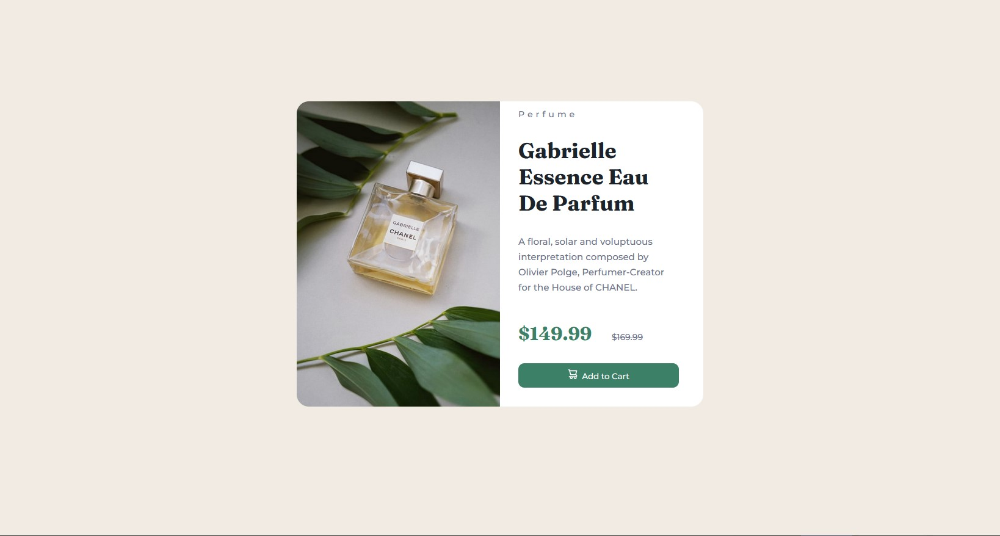
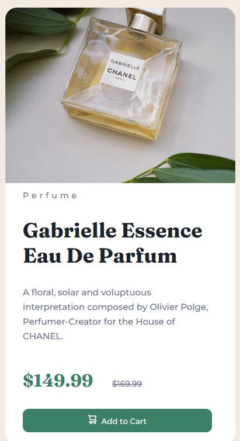

# Product Preview Card Component

## Overview

This project consists of a simple, responsive product preview card component designed to showcase products effectively, particularly focusing on perfumes. It's built with HTML and CSS, featuring modern design principles and a mobile-first approach. The component displays product images, names, descriptions, and prices, along with an "Add to Cart" button for user interaction.

## Features

- **Responsive Design:** The layout adapts to screen sizes, ensuring a seamless experience on both desktop and mobile devices.
- **Elegant Typography:** Utilizes Google Fonts (`Fraunces` and `Montserrat`) to enhance the readability and aesthetic appeal of the product information.
- **Interactive UI Elements:** An "Add to Cart" button with an icon, offering a clear call-to-action for users.
- **Stylized Product Information:** Displays the product name (`Gabrielle Essence Eau De Parfum`), a brief description, and pricing information, highlighting a special offer.

## Screenshots





## Setup

To use this component in your project, follow these steps:

1. **Clone the Repository:**

```bash
git clone https://your-repository-link.git
```

2. **Navigate to the Project Directory:**

```bash
cd path-to-your-project
```

3. **Open the `index.html` file in a web browser to view the component.**

## Customization

- **Images:** Replace `images/image-product-desktop.jpg` with your product image to customize the appearance.
- **Text Content:** Modify the `h1`, `h2`, and `p` tags within the `prod-box-holder` class to reflect your product's name, description, and pricing.
- **Styling:** Adjust the CSS in `styles.css` to match your brand's color scheme and typography preferences.

## Dependencies

- Google Fonts: [Fraunces](https://fonts.google.com/specimen/Fraunces) and [Montserrat](https://fonts.google.com/specimen/Montserrat) for typography.
